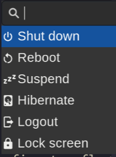

# Wofi power menu


[](https://github.com/pre-commit/pre-commit)

Implements a power menu using the [wofi](https://sr.ht/~scoopta/wofi/) launcher.

## Installation

### Nix

#### Option 1: Using flakes (recommended)

If you have flakes enabled:

```bash
# Install directly
nix profile install github:szaffarano/wofi-power-menu

# Or run without installing
nix run github:szaffarano/wofi-power-menu
```

#### Option 2: Add to your NixOS configuration

Add to your `configuration.nix`:

```nix
{
  inputs.wofi-power-menu.url = "github:szaffarano/wofi-power-menu";
  
  outputs = { nixpkgs, wofi-power-menu, ... }: {
    # Your existing config...
    
    environment.systemPackages = with pkgs; [
      # Your other packages...
      wofi-power-menu.packages.${system}.default
    ];
  };
}
```

### Arch Linux

#### From sources

You can install this project using an [unofficial AUR
package](https://aur.archlinux.org/packages/wofi-power-menu) (Thanks
[@AsfhtgkDavid](https://github.com/AsfhtgkDavid)):

```bash
yay -S wofi-power-menu
```

Alternatively, you can build from the AUR manually:

```bash
git clone https://aur.archlinux.org/wofi-power-menu.git
cd wofi-power-menu
makepkg -si
```

#### Prebuilt

If you don't want to spend time building it, you can download the prebuilt version:

```bash
yay -S wofi-power-menu-bin
```

Alternatively, you can install from the AUR manually:

```bash
git clone https://aur.archlinux.org/wofi-power-menu-bin.git
cd wofi-power-menu-bin
makepkg -si
```

You may need to download GPG keys:

```bash
gpg --recv-keys 42BE68F43D528467FC281E2E310FFE86A2E427BA
```

### Download Pre-built Binary

You can download the latest pre-built binary from the [GitHub releases page](https://github.com/szaffarano/wofi-power-menu/releases):

1. **Download the binary and verification files:**

   ```bash
   # Download the binary
   curl -LO https://github.com/szaffarano/wofi-power-menu/releases/latest/download/wofi-power-menu-linux-x64


   # Download verification files
   curl -LO https://github.com/szaffarano/wofi-power-menu/releases/latest/download/wofi-power-menu-linux-x64.asc
   curl -LO https://github.com/szaffarano/wofi-power-menu/releases/latest/download/wofi-power-menu-linux-x64.sha256
   curl -LO https://github.com/szaffarano/wofi-power-menu/releases/latest/download/wofi-power-menu-linux-x64.sha256.asc
   ```

1. **Import the PGP public key:**

   ```bash
   # Download and import the public key
   gpg --recv-keys 42BE68F43D528467FC281E2E310FFE86A2E427BA
   ```

1. **Verify the signature:**

   ```bash
   # Verify the signed checksum
   gpg --verify wofi-power-menu-linux-x64.sha256.asc wofi-power-menu-linux-x64.sha256


   # Verify the binary checksum
   sha256sum -c wofi-power-menu-linux-x64.sha256
   ```

1. **Install the binary:**

   ```bash
   # Make executable and move to PATH
   chmod +x wofi-power-menu-linux-x64
   sudo mv wofi-power-menu-linux-x64 /usr/local/bin/wofi-power-menu
   ```

**Note:** All releases are signed with the PGP key
`42BE68F43D528467FC281E2E310FFE86A2E427BA` (Sebastián Zaffarano
<sebas@zaffarano.com.ar>).

### Build from Source

If your distribution isn't listed above, you can build from source:

```bash
# Install Rust (if not already installed)
curl --proto '=https' --tlsv1.2 -sSf https://sh.rustup.rs | sh
source $HOME/.cargo/env

# Clone the repository
git clone https://github.com/szaffarano/wofi-power-menu.git
cd wofi-power-menu

# Build and install
cargo install --path .
```

Requirements:

- Rust 1.70 or newer
- [wofi](https://sr.ht/~scoopta/wofi/) installed on your system

## Usage

Just run the program to show the power menu:



## CLI configuration

```bash
$ wofi-power-menu --help

Shows a highly configurable power menu using wofi

Usage: wofi-power-menu [OPTIONS]

Options:
  -v, --verbose                Print additional information
  -w, --wofi-path <WOFI_PATH>  Path to the wofi binary
  -d, --disable <DISABLE>      Menu item to disable (accepts multiple values)
  -D, --dry-run                Simulate the command without executing it
  -c, --confirm <CONFIRM>      Menu item to force confirmation
  -l, --list-items             Show the menu items and exit
  -h, --help                   Print help
  -V, --version                Print version
```

Example

```bash
# list items
./wofi-power-menu -l
No config file found, using default values
Available items:
----------------
shutdown: Shut down [disabled: false, confirmation: true]
reboot: Reboot [disabled: false, confirmation: true]
suspend: Suspend [disabled: false, confirmation: true]
hibernate: Hibernate [disabled: false, confirmation: false]
logout: Logout [disabled: false, confirmation: false]
lock-screen: Lock screen [disabled: false, confirmation: false]

# enables confirmation for lock screen and suspend
./wofi-power-menu --confirm lock-screen --confirm reboot

# "hides" hibernate
./wofi-power-menu --disable hibernate
```

## Configuration File

Optionally you can create `$XDG_CONFIG_HOME/wofi-power-menu.toml` to customize
the app:

```toml
[wofi]
  path = "/alternative/path/to/wofi"
  extra_args = "--allow-markup --columns=1 --hide-scroll"

[menu.shutdown]
  title = "Apagar"

[menu.reboot]
  title = "Reiniciar"

[menu.suspend]
  title = "Suspender"
  enabled = "false"

[menu.hibernate]
  title = "Hibernar"

[menu.logout]
  title = "Salir"

[menu.lock-screen]
    title = "Bloquear pantalla"
    requires_confirmation = "false"

[menu.ls]
  title = "Listar directorio"
  cmd = "ls -l --color"
  icon = "L"
```

You can configure a custom wofi location as well as change which wofi extra
flags to use.

Also, you can customize the menue either:

1. Overriding default values in any existing menu entry. The above example
   translates the titles to Spanish, disables the `requires_confirmation` flag
   for the `lock-screen` item, and hides (i.e. set `enabled=false` the
   `suspend` item.
1. Adding new entries, like `ls`. Notice that the only optional field are
   `requires_confirmation` (defaults to `false`) and `enabled` (defaults to
   `true`), you have to set `title`, `cmd` and `icon`.

## Related tools

Highly inspired by his cousin [rofi-power-menu](https://github.com/jluttine/rofi-power-menu).
